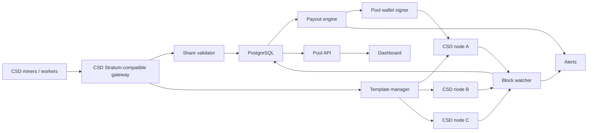
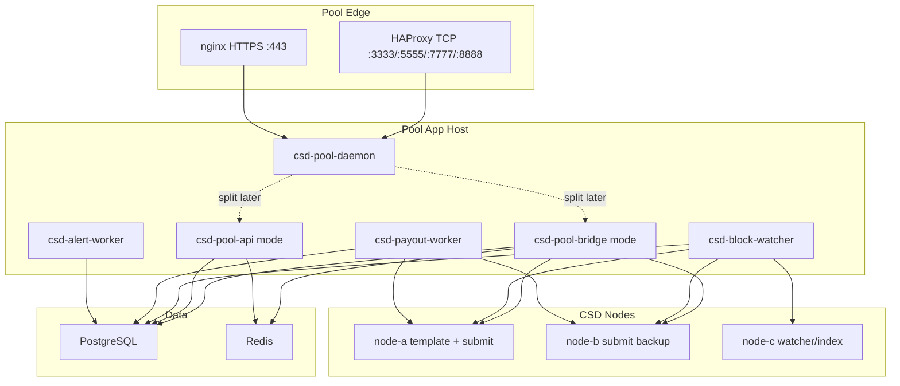

# CSD Mining Pool Architecture

## 1. Goal

Build a CSD pool with the product behavior of Pearlhash or Herominers:

- public pool endpoint
- worker names and per-worker hashrate
- pool hashrate, network hashrate, luck, round progress
- found block / immature / confirmed reward lifecycle
- PPLNS and optional solo mode
- automatic payouts
- operator fee
- clean dashboard and API
- DingTalk/Telegram-style operator notifications

The important difference is that CSD is not currently exposed like a typical
Bitcoin-family coin with a mature `getblocktemplate` plus miner Stratum stack.
The design therefore separates the mature pool framework from a custom CSD
adapter.

## 2. Background Learned From Existing CSD Work

Existing operations established these facts:

- The fleet was effectively **same-wallet solo mining**, not a real pool.
- CSD miner process: `csd-miner.service`.
- CUDA helper: `csd-cuda-search`.
- Local RPC commonly listens on `127.0.0.1:8790` or `0.0.0.0:8790`.
- `/health` and `/metrics` do not expose miner hashrate.
- Real miner hashrate is parsed from systemd journal lines such as:

```text
event=cuda_round_completed height=32260 devices=8 completed=8 searched=34359738368 elapsed_ms=1200 hps=28615423320.429
```

- A100 8-card hosts have been observed around 28.5 GH/s.
- V100 8-card hosts have been observed around 24.8 GH/s.
- Public network hashrate should come from Cairn network telemetry, not local
  estimates.
- Internal bootmesh improved block propagation and reduced stale impact.
- Monitoring should use RPC health first, SSH logs second, and avoid restarting
  miners on transient SSH failures.

Current implementation note: when `CSD_POOL_NETWORK_URL` is set, `/api/pool`
loads `<base>/api/network` with a short timeout and maps `hashrate` or
`hashrateGHs` into `network_hashrate_hs`. Telemetry failure does not fail the
pool API.
Pool hashrate is an in-process estimate from accepted Stratum share difficulty
over the current runtime window. When PostgreSQL is configured, `/api/history`
also returns durable bucketed history from `shares` and `share_events`, including
accepted, rejected, and stale share counts plus accepted-share-derived pool
hashrate. `/api/history` fills `net_hs` from current `CSD_POOL_NETWORK_URL`
telemetry when available; persisted historical network hashrate can later come
from the node sample pipeline.
Current round effort is estimated from accepted share difficulty in the active
round divided by `network_hashrate_hs * target_block_secs / 2^32`; the round
work resets when a block candidate is found.
`/api/pool` aggregates persisted `blocks.effort_pct` into 24h, 7d, and lifetime
average effort plus luck percentages, where `100` is expected luck.
The built-in dashboard renders its share activity chart from `/api/history` with
12h, 24h, and 7d range buttons, plus a live counter fallback for history
outages.
Its Recent Blocks table displays finder/worker, status, confirmations, reward,
and per-block effort from `/api/blocks`.

## 3. Best References

### Primary CSD Reference: Yamaduo / CSD-Mining-pool-public

The most important CSD-specific reference is the live Yamaduo pool and its
public miner repository:

- Pool page: `https://pool.yamaduo.no/`
- Stratum endpoint shown by the page: `pool.yamaduo.no:3333`
- Miner repo: `https://github.com/dangraagu/CSD-Mining-pool-public`
- Latest observed release: `v0.1.6`
- License: MIT OR Apache-2.0

The pool page exposes these dashboard endpoints:

```text
GET /api/pool
GET /api/metrics
GET /api/history
GET /api/miner/:address
```

The currently observed `/api/pool` schema is:

```json
{
  "pool_hashrate_hs": 744449784792.9026,
  "network_hashrate_hs": 2276860335272.5796,
  "network_share_pct": 32.69633069978265,
  "total_blocks": 180,
  "canonical_blocks": 3726,
  "workers_online": 55,
  "shares_accepted": 77586,
  "payout_interval_secs": 1800,
  "next_payout_secs": 347,
  "confirm_depth": 10
}
```

Our compatible `/api/pool` keeps this field shape, but computes
`next_payout_secs` from the latest persisted payout batch when PostgreSQL is
configured. This keeps public dashboard behavior stable while making the ETA
reflect real payout activity.

The observed `/api/metrics` shape is:

```json
{
  "workers": {
    "<addr20>": {
      "shares_accepted": 161,
      "shares_rejected": 2,
      "blocks_found": 1,
      "last_difficulty": 76.35968922664692
    }
  },
  "totals": {
    "workers_online": 55,
    "shares_accepted": 77602,
    "shares_rejected": 4830,
    "blocks_found": 180
  },
  "fee_revenue": 0
}
```

The miner repository shows a CSD-specific Stratum v1 protocol:

```text
mining.subscribe result:
  [ignored, extranonce1_hex, extranonce2_size]

mining.authorize:
  [addr20, "x"]

mining.set_difficulty:
  [difficulty]

mining.notify:
  [
    job_id,
    prev_hash_be_hex,
    coinb1_hex,
    coinb2_hex,
    merkle_branches_hex[],
    version_hex,
    nbits_hex,
    ntime_hex,
    clean_jobs
  ]

mining.submit:
  [worker_name, job_id, extranonce2_hex, ntime_hex, nonce_hex]
```

Important CSD header/coinbase details from the miner implementation:

- CSD header is 84 bytes:
  `version_LE || prev_hash || merkle_root || time_u64_LE || bits_LE || nonce_LE`
- Stratum sends `prev_hash` as big-endian hex; the miner reverses it for the
  stored CSD header order.
- Coinbase is reconstructed as:
  `coinb1 || extranonce1[4] || extranonce2[4] || coinb2`
- The miner composes the 8-byte CSD coinbase extranonce as:
  `extranonce = xn1_low | (xn2 << 32)`.
- `ntime` is 4 bytes in Stratum, then zero-extended into CSD's 64-bit header
  time field.

This means the fastest route to our own pool is **not** inventing a new miner
protocol. It is to implement a server compatible with this existing public CSD
miner.

### Consensus And Wallet References

Mining and payout compatibility must be checked against the official Rust node,
not inferred from dashboard behavior:

- Official node: `https://github.com/compute-substrate/compute-substrate`
- Canonical SDK: `https://github.com/InverseAltruism/csd-sdk`
- Production transaction builder: `@inversealtruism/csd-tx`

The node accepts `POST /tx/submit` with `{ "tx": node_tx }`. The canonical SDK
produces the same `node_tx` JSON: 32-byte prevout transaction IDs, 99-byte
compact-signature/public-key scripts, 20-byte P2PKH outputs, and `app: "None"`
for ordinary payouts. Pool payout gates and workers use this contract directly;
arbitrary raw hex is not production evidence.

### Architecture Reference: Miningcore

Miningcore is the best architecture reference for this project. It is MIT
licensed and includes a high-performance Stratum server, vardiff, share
processor, payment processor, PostgreSQL persistence, live stats API, and
WebSocket event streaming.

Use it as the model for:

- pool process topology
- share table schema
- balance and payment lifecycle
- vardiff behavior
- miner banning / flood handling
- API shape
- block status lifecycle

Do not assume CSD can be added only by configuration. CSD will need a new coin
module and probably new node RPC endpoints or a CSD bridge modeled after the
Yamaduo server side.

### Secondary References

- Node Open Mining Portal / NOMP: good conceptual reference for older
  Bitcoin-like Stratum pools, but less attractive as a new production base.
- Yiimp: mature multi-coin pool family, useful for operational ideas, but PHP
  stack and legacy process model are not ideal for a new CSD-specific build.
- Stratum V2 libraries: useful later if CSD wants a modern miner protocol, but
  it is overkill for the first private pool.

## 4. Proposed System



## 5. Components

### 5.1 CSD Node Cluster

Run at least three pool-owned CSD nodes:

- one primary template/submission node
- one hot standby
- one public telemetry/indexing node

Each node should be connected through a fixed bootmesh and monitored for:

- height
- chainwork
- peer count
- mempool size
- last accepted block
- RPC latency

### 5.2 Template Manager

Responsibilities:

- poll or subscribe to tip changes
- build current mining job
- reserve extranonce / nonce ranges per connected worker
- refresh jobs immediately when tip changes
- keep previous jobs briefly valid for late share attribution
- submit candidate blocks to multiple CSD nodes

Required CSD work API or internal bridge API, if not already present:

```text
getMiningTemplate(poolAddress, coinbaseTag)
submitMinedBlock(block)
validatePowHeader(header, difficulty)
decodeCandidate(nonce, extraNonce, workerPayload)
```

Yamaduo proves this can exist as a CSD Stratum bridge. The remaining task is to
locate or reproduce the server-side bridge that creates the `mining.notify`
9-tuple and verifies `mining.submit`.

### 5.3 Miner Gateway

For external miners, expose a Stratum V1-compatible TCP endpoint first,
compatible with `CSD-Mining-pool-public`:

```text
mining.subscribe
mining.authorize
mining.set_difficulty
mining.notify
mining.submit
```

CSD-specific fields are carried in the `mining.notify` job payload while keeping
the outer protocol familiar. Worker login format should match the public miner:

```text
addr20
```

Optionally add our own account worker suffix later:

```text
addr20.worker
```

Use TLS-capable ports for public launch:

- `3333`: low difficulty / small miners
- `5555`: medium difficulty
- `7777`: high difficulty / rented hash
- `8888`: solo mode

### 5.4 Share Validator

Every submitted share must be checked for:

- known job id
- worker authorization
- nonce range ownership
- duplicate nonce
- target <= assigned share difficulty
- candidate target <= network target, then submit block

Persist all accepted shares. Rejected shares should be sampled and aggregated;
do not write every spam rejection at full public scale.

### 5.5 Reward Accounting

Recommended launch modes:

1. **Private/internal mode:** proportional by observed worker shares per round.
2. **Public beta:** PPLNS with a conservative window.
3. **Optional solo port:** full block reward to the worker minus pool fee.

For CSD, treat a found block as:

```text
submitted -> seen_on_chain -> immature -> confirmed -> credited -> paid
```

Use at least 6 confirmations for public accounting unless chain behavior shows a
different finality risk profile.

### 5.6 Payout Engine

Payout engine should:

- keep hot wallet funds limited
- sign from an isolated wallet host or local signer
- batch payouts to reduce UTXO fragmentation
- enforce minimum payout threshold
- keep operator fee explicit
- never expose private keys to the web/API host

CSD is UTXO-based and has many coinbase-like rewards, so coin selection and UTXO
management matter. Avoid creating too many tiny outputs.

### 5.7 Dashboard

Miner-facing pages:

- pool hashrate
- network hashrate
- workers online
- current round effort
- block history
- miner hashrate
- miner shares
- estimated earnings
- unpaid / paid balance
- payout history
- getting started instructions

Operator pages:

- node health
- stale rate
- orphan/reorg rate
- share rejection reasons
- top workers
- suspicious workers
- payout queue
- wallet balance and UTXO pressure

## 6. Database Sketch

Core tables:

```text
workers(id, account, worker_name, created_at, last_seen_at)
worker_sessions(id, worker_id, ip, user_agent, connected_at, disconnected_at)
jobs(id, height, prev_hash, network_target, created_at, retired_at)
shares(id, pool_id, worker_id, job_id, difficulty, is_block_candidate, created_at)
blocks(id, height, hash, worker_id, status, reward, confirmations, created_at)
balances(account, asset, confirmed, immature, updated_at)
payouts(id, account, amount, fee, txid, status, created_at)
node_samples(id, node, height, chainwork, peers, rpc_ms, created_at)
```

Partition `shares` by time or pool id before public traffic. Share volume grows
fast.

## 7. MVP Plan

### Phase 0: Yamaduo compatibility audit

Read `dangraagu/CSD-Mining-pool-public` end to end and pin compatibility tests
for:

- Stratum framing and method tuples
- target/difficulty conversion
- `prev_hash` byte order
- 84-byte header assembly
- `extranonce1` / `extranonce2` split
- `ntime` zero-extension
- share ack/reject/stale classification
- payout and dashboard API shapes

### Phase 1: Source confirmation

Confirm from CSD source whether these exist:

- mining template construction
- block submission RPC
- header/PoW validation helpers
- CUDA miner input/output format
- reward maturity rules
- reorg handling behavior

### Phase 2: Compatible pool bridge

Implement the server side of the Yamaduo-style protocol:

- TCP Stratum listener
- subscribe/authorize
- vardiff
- notify job builder
- submit verifier
- candidate block submitter
- `csd-pool-workers check-node-template` live adapter contract verification
- `csd-pool-workers check-node-runtime` multi-node quorum and latency verification
- `/api/pool`, `/api/metrics`, `/api/history`, `/api/miner/:address`

### Phase 3: Internal fleet migration

Run our A100/V100 machines against our own pool using either:

- the public `csd-pool-miner` after benchmarking, or
- a patched high-throughput CSD CUDA miner speaking the same submit protocol.

### Phase 4: Public pool

Add:

- DNS and TLS where applicable
- public install docs
- payout transparency
- operator fee
- DDoS protection
- geo endpoints

### Fallback Phase: Internal pool dashboard

Use current same-wallet mining:

- parse every miner's `cuda_round_completed hps=...`
- track found/accepted blocks from node logs and explorer
- attribute block source if logs identify host/worker
- calculate internal hashrate and expected block interval
- expose Herominers-like dashboard

This fallback is still useful if server-side Stratum bridge reproduction takes
longer than expected.

## 8. Key Engineering Risks

- **Server-side bridge availability.** The public miner proves the client side,
  but the pool server implementation still needs to be obtained or reproduced.
- **Share validation cost.** The pool must validate shares cheaply without
  invoking GPU code.
- **Nonce range correctness.** Duplicate work would silently reduce effective
  hashrate.
- **Block propagation.** Prior operations showed stale/propagation delay matters.
- **Wallet safety.** Pool wallet must be isolated from the public web stack.
- **UTXO bloat.** Frequent small payouts can degrade wallet usability.
- **Reorg accounting.** Blocks must not be credited as final too early.

## 9. Decision

Start from **Yamaduo protocol compatibility** and use **Miningcore-inspired
production architecture** for persistence, payments, vardiff, bans, and APIs.
Do not fork Yiimp/NOMP unless the goal is only a quick UI clone.

The first real coding milestone should be:

```text
csd-pool-daemon:
  - starts CSD Stratum and public API in one process for MVP
  - shares live runtime counters between Stratum sessions and API routes

csd-pool-bridge:
  - accepts CSD-Mining-pool-public miners on Stratum v1
  - talks to 3 CSD RPC nodes
  - builds Yamaduo-compatible mining.notify jobs
  - validates mining.submit shares
  - submits candidate blocks
  - stores shares/blocks/balances in PostgreSQL
  - exposes /api/pool, /api/metrics, /api/history, /api/miner/:address
  - renders a basic Yamaduo/Herominers-style dashboard
```

Then harden payouts and public operations.

## 10. Target Technical Stack

Recommended stack for the first production implementation:

```text
Language/runtime:
  Rust for Stratum bridge, share validator, template manager, payout worker
  TypeScript/Next.js or lightweight Rust/HTMX for dashboard

Storage:
  PostgreSQL for durable accounting
  Redis for short-lived sessions, live counters, vardiff state, and pub/sub

Networking:
  HAProxy or nginx stream proxy in front of Stratum TCP ports
  nginx/Caddy in front of HTTP dashboard/API

Observability:
  Prometheus metrics
  Grafana dashboards
  structured JSON logs
  alertmanager or webhook bridge for DingTalk/Telegram/Discord

Process manager:
  systemd for simple deployment
  Docker Compose only after secrets and volume rules are clear
```

Current repository status: `ops/` includes single-host systemd units, worker
timers, an HAProxy TCP/HTTP template, an environment-file example, and a restore
drill. Payout operations are split across independent create, sign, submit, and
reconcile timers so each stage can retry on its own cadence. The deployment
verifier checks HAProxy public binds, local backends, Stratum connection caps,
and the API health check. These templates target a private beta or small public
beta; multi-region edge deployment still needs external orchestration and shared
Redis-backed session/ban state.

Rust is the safest default because the CSD miner and protocol reference are
already Rust, and the pool has high-concurrency TCP plus consensus-sensitive
byte handling.

## 11. Deployment Topology

### 11.1 Minimal Private Beta



For the first private beta, `csd-pool-daemon` is the preferred launch command:
it runs the API and Stratum bridge together with one shared runtime state. The
separate `csd-pool-bridge` and `csd-pool-api` binaries remain useful for
debugging and later horizontal scaling.

### 11.2 Public Scale

Split components:

- edge hosts in multiple regions
- regional Stratum bridge instances
- central PostgreSQL primary with read replica
- Redis Sentinel or managed Redis
- independent payout signer host
- at least 3 CSD full nodes, preferably across providers

Stratum bridge instances must be stateless except for Redis/DB-backed session
state so miners can reconnect or fail over cleanly.

## 12. Service Boundaries

### 12.1 `csd-stratum-bridge`

Responsibilities:

- accept TCP connections
- parse JSON-RPC line frames
- subscribe/authorize
- assign extranonce1
- send `mining.set_difficulty`
- send `mining.notify`
- receive `mining.submit`
- validate share format and duplicate status
- forward candidate blocks
- update live counters
- persist accepted shares

Current implementation note: when `CSD_POOL_DATABASE_URL` is configured, the
bridge applies migrations on startup and writes Stratum jobs plus accepted
shares through `MiningRepository`. When `CSD_POOL_SUBMIT_CANDIDATES=true`, it
submits structured candidate payloads to the configured submit node and can
record the submitted candidate in `blocks`. Without a database URL, it runs in
in-memory development mode.

It should not:

- sign payout transactions
- expose private keys
- calculate final balances
- serve admin-only APIs

### 12.2 `csd-template-manager`

May be embedded in the bridge for MVP, but should be a clear module.

Responsibilities:

- poll CSD node tip
- construct or fetch block template
- split coinbase into `coinb1` / `coinb2`
- track job ids
- retire old jobs
- publish job updates to all Stratum sessions

### 12.3 `csd-share-processor`

May be embedded in the bridge at first.

Responsibilities:

- validate share hash against assigned share target
- validate candidate block hash against network target
- deduplicate `(worker_id, job_id, extranonce2, ntime, nonce)`
- store accepted shares
- aggregate rejected/stale reasons
- emit block-candidate events

### 12.4 `csd-block-watcher`

Responsibilities:

- watch all CSD nodes and public explorer if needed
- detect submitted blocks on canonical chain
- mark blocks orphaned or confirmed
- move rewards from immature to confirmed
- handle reorgs idempotently

### 12.5 `csd-reward-engine`

Responsibilities:

- calculate PPLNS window
- allocate block rewards to miners
- subtract pool fee
- write immutable reward allocation rows
- update balances in one transaction
- expose reward, block, payment, and miner balance read models through
  `DashboardRepository` for the public API

### 12.6 `csd-payout-worker`

Responsibilities:

- select payable balances
- build payout batch
- dry-run transaction
- request signer
- submit transaction to multiple nodes
- track confirmation
- mark payouts paid

### 12.7 `csd-signer`

Responsibilities:

- hold hot wallet key or connect to wallet daemon
- sign only approved payout batches
- enforce max amount per batch and per day
- log signed batch ids and txids

This should be isolated from the public web/API host.

Current implementation note: `csd-pool-signer` provides the stable signer HTTP
surface and a deterministic mock signing mode for integration testing. It
validates batch totals and addr20 outputs, supports optional bearer token
authentication through `[signer].token_env`, compares bearer tokens with a
fixed-time equality helper, and returns `raw_tx_hex` plus `txid`.
`csd-pool-workers check-signer` probes `/health` and the signing endpoint with a
1 base-unit `contract-check-*` request before payouts are resumed. It is not a
real wallet signer; production deployment should replace the
mock internals with wallet-backed transaction construction while keeping the
same API contract. Real go-live evidence requires signer `/health.mode` to be
present and non-mock, for example `wallet`; `mock`, `dev`, and `test` modes are
rejected by `signer-safety.log` verification. The signer must also expose
`/health.wallet_address`, and real go-live evidence requires it to match
`CSD_POOL_SIGNER_WALLET_ADDRESS`. The contract report includes
`raw_tx_mock_prefix_present`; production signoff requires it to be false so the
bundled deterministic mock signer cannot be accepted by changing only its
reported mode.

### 12.8 `csd-pool-api`

Responsibilities:

- serve public dashboard data
- serve miner lookup data
- serve block and payment history
- serve operator API behind auth

It should read from PostgreSQL/Redis only. It should not query wallet secrets.
Current implementation note: PostgreSQL miner and worker read models aggregate
accepted shares from `shares` and rejected/stale share quality totals from
`share_events` before joining, which avoids inflated counts when workers also
have block records.

## 13. End-To-End Data Flows

### 13.1 Miner Connects

```text
miner -> bridge: TCP connect
miner -> bridge: mining.subscribe
bridge -> miner: extranonce1, extranonce2_size=4
miner -> bridge: mining.authorize [addr20, "x"]
bridge:
  - validate address
  - create or update miner + worker
  - open session row
bridge -> miner: authorize true
bridge -> miner: set_difficulty
bridge -> miner: notify current job
```

### 13.2 Share Submit

```text
miner -> bridge: mining.submit [worker, job_id, extranonce2, ntime, nonce]
bridge:
  - find job
  - rebuild coinbase
  - rebuild merkle root
  - rebuild 84-byte header
  - sha256d(header)
  - compare to share target
  - compare to network target
  - deduplicate
  - persist accepted share
bridge -> miner:
  - result true
  - or stale/reject reason
```

If the share is also a block candidate:

```text
bridge -> CSD submit adapter:
  - job id
  - 84-byte header hex
  - hash / coinbase txid / merkle root
  - extranonce2 / ntime / nonce
adapter -> CSD node A/B/C:
  - construct chain-specific raw block
  - submit block
bridge -> DB:
  - block status = submitted
  - effort_pct from active-round share difficulty versus network target
  - candidate payload JSON
  - node submit response JSON
watcher -> DB: seen_on_chain / orphan / confirmed
reward-engine -> DB: allocations
```

Current watcher adapter contract:

```text
GET /api/rpc/block/status?hash=<hash>

{
  "hash": "64 hex chars",
  "status": "submitted|seen_on_chain|immature|confirmed|orphaned",
  "height": 123,
  "confirmations": 10,
  "reward_base_units": 5000000000
}
```

`csd-pool-workers reconcile-blocks` reads non-terminal blocks from PostgreSQL
and applies that response to `blocks.status`, confirmations, height, and reward.

### 13.3 Reward Allocation

```text
block confirmed
reward-engine loads PPLNS share window
reward-engine calculates miner weights
reward-engine writes reward_immature + pool_fee ledger entries
reward-engine updates immature balances
after confirm_depth:
  reward-engine writes reward_mature ledger entries
  reward-engine moves immature balances to confirmed balances
```

The allocation must be immutable. If a reorg happens, write compensating rows
instead of mutating historical records invisibly.

Current implementation note: `csd-pool-workers settle-rewards` reads confirmed
blocks that do not yet have block ledger entries, uses accepted shares for the
block's job as the initial PPLNS window, writes immutable ledger entries, and
increments `balance_cache.immature_base_units` for miners.
`csd-pool-workers mature-rewards` then writes idempotent `reward_mature` entries
after `pool.confirm_depth` and moves balances into
`balance_cache.confirmed_base_units`. If a previously rewarded block becomes
`orphaned`, `csd-pool-workers reverse-orphans` writes negative
`reward_orphan_reversal` rows and subtracts the reward from the immature or
confirmed balance bucket according to whether that miner's reward had already
matured. A later upgrade should widen the PPLNS window across the last N
weighted shares rather than only the found block's job.

### 13.4 Payout

```text
payout-worker locks payable balances
payout-worker creates payout_batch
payout-worker asks signer to sign exact outputs
signer returns official CSD node transaction JSON + txid
payout-worker broadcasts to CSD nodes
payout-worker marks batch submitted
watcher confirms payout tx
payout-worker marks recipients paid
```

Current implementation note: `csd-pool-workers create-payouts` builds a batch
from confirmed balances above `[pool].minimum_payout_csd` and writes
`payout_lock` rows in the same database transaction. `sign-payouts` sends exact
outputs to `POST /api/payout/sign`, verifies the official CSD transaction shape
and exact payout outputs, and stores versioned node transaction JSON plus txid.
`submit-payouts` broadcasts `{ "tx": node_tx }` directly through the official
`POST /tx/submit` contract at `CSD_POOL_PAYOUT_NODE_URL`. The separate
`CSD_POOL_SUBMIT_NODE_URL` remains the pool adapter for structured block
candidate submission. A legacy `/api/rpc/tx/submit` adapter fallback is kept
for migration and local mock compatibility.
`reconcile-payouts` checks `GET /api/rpc/tx/status?txid=<txid>` and writes
`payout_sent` when confirmed. Failure paths write `payout_failed_unlock` so
locked funds return to confirmed balances without mutating historical ledger
rows. The operator API can pause and resume payouts by updating the PostgreSQL
`pool_settings.payouts_enabled` flag; create/sign/submit workers honor it, while
reconciliation keeps running for already-submitted transactions. Operators can
cancel `created` or `signed` batches, which writes `payout_failed_unlock`, and
can retry `failed` or `cancelled` batches by creating a new locked batch with the
same recipients. CSV export emits one row per payout recipient for accounting
reconciliation.

Broadcast transport failures and explicit rejections do not automatically
unlock balances because the request may have reached the node before its
response was lost. Such batches remain `signed` for retry. When the official
node returns its ambiguous `already present or mempool conflict` result with
the expected txid, the batch becomes `submitted` and the watch adapter decides
whether it confirms or needs operator investigation. This favors a stuck alert
over a possible duplicate payout.

Safety default: new deployments and upgrades set `payouts_enabled=false`.
Operators must explicitly resume payouts after the signer, wallet limits, daily
cap, manual approval threshold, and `check-signer` output are reviewed.

## 14. Consistency And Idempotency Rules

These are required before public launch:

- A share insert is unique by `(job_id, worker_id, extranonce2, ntime, nonce)`.
- A block candidate is unique by block hash.
- A reward allocation is unique by `(block_id, miner_id, reward_mode)`.
- A payout recipient row is unique by `(batch_id, miner_id)`.
- Retrying block submission must not create duplicate block records.
- Retrying payout broadcast must not create a second payout batch.
- Payout batches are append-only after signing.
- Balance updates happen inside database transactions.
- Reorg corrections are separate ledger rows, not silent edits.

Use ledger-style accounting:

```text
ledger_entries(
  id,
  miner_id,
  asset,
  amount,
  kind,
  ref_type,
  ref_id,
  created_at
)
```

Then derive balances from ledger entries or maintain cached balances that can be
fully recomputed.

## 15. Database Design Detail

Recommended durable tables:

```text
miners(
  id bigserial primary key,
  address text unique not null,
  created_at timestamptz not null,
  last_seen_at timestamptz
)

workers(
  id bigserial primary key,
  miner_id bigint not null references miners(id),
  name text not null,
  created_at timestamptz not null,
  last_seen_at timestamptz,
  unique(miner_id, name)
)

sessions(
  id uuid primary key,
  worker_id bigint not null references workers(id),
  remote_addr inet,
  remote_port integer,
  user_agent text,
  server_session_id bigint,
  server_release text not null,
  server_instance text not null,
  assigned_difficulty numeric not null,
  difficulty_updated_at timestamptz not null,
  started_at timestamptz not null,
  ended_at timestamptz
)

jobs(
  id text primary key,
  prev_hash text not null,
  height bigint,
  nbits text not null,
  ntime text not null,
  network_target bytea not null,
  clean_jobs boolean not null,
  created_at timestamptz not null,
  retired_at timestamptz
)

shares(
  id bigserial primary key,
  worker_id bigint not null references workers(id),
  session_id uuid references sessions(id),
  job_id text not null references jobs(id),
  difficulty numeric not null,
  hash bytea not null,
  extranonce2 text not null,
  ntime text not null,
  nonce text not null,
  is_block_candidate boolean not null,
  created_at timestamptz not null,
  unique(job_id, worker_id, extranonce2, ntime, nonce)
)

blocks(
  id bigserial primary key,
  height bigint,
  hash text unique,
  job_id text references jobs(id),
  finder_worker_id bigint references workers(id),
  reward_base_units numeric not null,
  status text not null,
  confirmations integer not null default 0,
  submitted_at timestamptz,
  seen_at timestamptz,
  confirmed_at timestamptz,
  orphaned_at timestamptz
)

ledger_entries(
  id bigserial primary key,
  miner_id bigint references miners(id),
  amount_base_units numeric not null,
  kind text not null,
  ref_type text not null,
  ref_id text not null,
  created_at timestamptz not null
)

ledger_entries_idempotency_idx unique on
  coalesce(miner_id::text, 'pool'), kind, ref_type, ref_id

payout_batches(
  id text primary key,
  status text not null,
  total_base_units numeric not null,
  txid text,
  raw_tx_hash text,
  created_at timestamptz not null,
  signed_at timestamptz,
  submitted_at timestamptz,
  confirmed_at timestamptz
)

payout_recipients(
  batch_id text references payout_batches(id),
  miner_id bigint references miners(id),
  address text not null,
  amount_base_units numeric not null,
  primary key(batch_id, miner_id)
)
```

Use `numeric` for CSD base units if values may exceed signed 64-bit constraints
in aggregate. Otherwise use `bigint` for speed after confirming maximum supply.

## 16. Configuration

Example config shape:

```toml
[pool]
id = "csd-main"
fee_percent = 1.0
confirm_depth = 10
payout_interval_secs = 1800
minimum_payout_csd = "1.0"
max_payout_batch_csd = "1000.0"
max_daily_payout_csd = "5000.0"
manual_payout_approval_csd = "250.0"

[stratum.port_3333]
listen = "0.0.0.0:3333"
initial_difficulty = 8
min_difficulty = 8
max_difficulty = 512
target_share_secs = 20

[stratum.port_7777]
listen = "0.0.0.0:7777"
initial_difficulty = 128
min_difficulty = 64
max_difficulty = 4096
target_share_secs = 20

[[csd_nodes]]
name = "node-a"
rpc_url = "http://10.0.0.11:8790"
role = "template,submit,watch"

[[csd_nodes]]
name = "node-b"
rpc_url = "http://10.0.0.12:8790"
role = "submit,watch"

[database]
url_env = "CSD_POOL_DATABASE_URL"

[redis]
url_env = "CSD_POOL_REDIS_URL"

[signer]
url_env = "CSD_POOL_SIGNER_URL"
```

Current implementation note: the bridge supports one `[stratum]` section and
keeps vardiff state in each TCP session. It sends the initial difficulty on
authorization, then uses an EWMA with explicit 0.70/1.40 hysteresis, a
120-second minimum adjustment interval, and a 2x single-step bound. The previous
lower difficulty remains valid for 120 seconds after an increase, and
`mining.suggest_difficulty` is safely clamped. The resulting value is rounded
to the nearest integer, matching the official miner before target generation
and persisted share accounting. The consensus adapter converts that assigned
difficulty into `base_share_target / difficulty` and validates the submit hash
against the effective target before persisting the share. Multi-port difficulty
tiers and Redis-backed shared vardiff state remain production scaling
follow-ups.

The bridge also emits a configurable same-tip heartbeat job every 120 seconds.
It refreshes timestamp/template data, assigns a new job ID, and sends
`clean_jobs=false`. A bounded in-memory registry retains same-tip jobs for late
submissions; only a changed previous hash clears that registry. PostgreSQL
records each publication as `tip_change` or `heartbeat`, while Prometheus
exports reason counters and the age of the latest publication.

Secrets must come from environment files or a secret manager, not committed
config files.
The API adds baseline browser security headers on every response:
Content-Security-Policy, X-Content-Type-Options, X-Frame-Options,
Referrer-Policy, and Permissions-Policy. Reverse proxies may tighten CSP further
once the dashboard is split into external static assets.

## 17. Observability

### 17.1 Metrics

Expose Prometheus metrics:

```text
csd_pool_workers_online
csd_pool_hashrate_hs
csd_pool_round_share_difficulty
csd_pool_stratum_connections
csd_pool_shares_total{result="accepted"}
csd_pool_shares_total{result="rejected"}
csd_pool_shares_total{result="stale"}
csd_pool_job_notify_total{reason="tip_change"}
csd_pool_job_notify_total{reason="heartbeat"}
csd_pool_job_notify_age_seconds
csd_pool_share_validation_seconds_sum
csd_pool_share_validation_seconds_count
csd_pool_share_validation_seconds_avg
csd_pool_blocks_found_total
csd_pool_blocks_submitted_total
csd_pool_blocks_confirmed_total
csd_pool_blocks_orphaned_total
csd_pool_fee_revenue_base_units
csd_pool_jobs_created_total
csd_pool_job_age_seconds
csd_pool_payout_batches_total{status}
csd_pool_payout_amount_base_units_total
csd_pool_service_up{service}
csd_node_rpc_latency_seconds{node}
csd_node_height{node}
csd_node_peers{node}
csd_pool_next_payout_seconds
csd_pool_updated_timestamp_seconds
```

Go-live verification stores `/metrics` in `http-prometheus-metrics.txt` and
requires `metrics-surface-safety.log` to prove the Prometheus surface includes
core pool, Stratum, share validation, payout, node health, signer health, and
freshness samples. Planned next metrics should be added as new operational risks
become concrete.

### 17.2 Logs

Use structured logs with:

- session id
- worker id
- miner address
- job id
- remote ip
- share result
- block hash
- payout batch id

Never log secrets, raw private keys, or full Authorization headers.
Operator API and signer API bearer tokens are compared with fixed-time equality
helpers to avoid prefix-match timing leaks in control-plane authentication.

### 17.3 Alerts

Critical alerts:

- no accepted shares for N minutes
- all CSD nodes behind public tip
- template age too old
- block submission failure
- payout signer down
- payout batch stuck
- no accepted shares
- worker offline
- database replica lag
- high stale rate
- high invalid share rate

Current implementation note: `csd-pool-workers sample-health` records CSD node
and signer health into `node_samples`. `check-alerts` upserts `service_health`
`template_age`, `block_submission`, `payout_stuck`, `no_accepted_shares`,
`worker_offline`, `high_reject_rate`, and `high_stale_rate` events into
`alert_events`. Block-submission alerts use `blocks.submit_response_json` and
`CSD_POOL_BLOCK_SUBMISSION_STUCK_MINUTES` to catch rejected submit responses and
submitted blocks that do not advance through the watcher. Template-age alerts
use latest `jobs.created_at` and `CSD_POOL_MAX_TEMPLATE_AGE_SECS`, then compare
the job's previous hash with each configured node tip. This keeps a valid job
active when the chain itself has not advanced while still detecting a daemon
that failed to refresh after a new tip. No-share alerts are based on latest
`shares.created_at` and `CSD_POOL_NO_ACCEPTED_SHARE_MINUTES`. Worker offline
alerts are based on `workers.last_seen_at` and `CSD_POOL_WORKER_OFFLINE_MINUTES`.
Private probe workers can be excluded from this alert alone with the
comma-separated `CSD_POOL_WORKER_OFFLINE_EXCLUDED_PREFIXES`; configured
prefixes must be reserved and must not match production workers.
Share quality alerts use accepted shares plus persisted `share_events` for
rejected/stale submissions over
`CSD_POOL_SHARE_QUALITY_WINDOW_MINUTES`. The operator API exposes latest health
samples, active/resolved alerts, and manual alert resolution.

Dashboard worker and miner counts come from distinct persisted workers seen in
the last five minutes. The API takes the maximum of that value and the current
in-memory Stratum session count so miners that reconnect for each submission do
not collapse the displayed worker count to one wallet or one TCP connection.

## 18. Security Design

### 18.1 Network Security

- Public: Stratum ports and HTTPS only.
- CSD RPC nodes: private network only.
- PostgreSQL/Redis: private network only.
- Signer: private network only, allowlist pool worker IP.

### 18.2 Abuse Controls

- per-IP connection cap
- per-address worker cap
- rate limit malformed JSON
- temporary ban for repeated invalid shares
- stale shares tracked separately from invalid shares
- duplicate share cache in Redis plus DB uniqueness

The current bridge includes a single-process `AbuseManager`:

- rejects new connections above `[abuse].max_connections_per_ip`
- rejects authorization above `[abuse].max_sessions_per_address` for the same
  mining address
- counts malformed JSON frames, invalid authorization attempts, and invalid
  shares by source IP
- applies temporary in-memory bans for `[abuse].ban_secs`
- releases active IP and address counters when the Stratum session closes

This is sufficient for a first public single-instance deployment or an
HAProxy-fronted active/passive setup. A horizontally scaled bridge should move
the same counters to Redis and keep HAProxy connection/rate limits in front.

### 18.3 Wallet Controls

- hot wallet limit
- daily payout cap
- manual approval above threshold
- emergency payout pause
- signer audit log
- cold wallet sweep procedure

Current implementation note: `[pool].max_payout_batch_csd` and
`CSD_POOL_MAX_PAYOUT_BATCH_CSD` cap automatic `create-payouts` batches.
`[pool].max_daily_payout_csd` and `CSD_POOL_MAX_DAILY_PAYOUT_CSD` cap the sum
of today's active payout batches. `[pool].manual_payout_approval_csd` and
`CSD_POOL_MANUAL_PAYOUT_APPROVAL_CSD` put larger batches into `needs_approval`.
Those batches lock balances but are invisible to `sign-payouts` until
`POST /api/operator/payouts/{batch_id}/approve` moves them to `created`. The
operator preview API and `payout-preview` command expose `cap_exceeded`,
`daily_cap_exceeded`, and `manual_approval_required` before balances are locked.
Payouts start paused by default and require explicit operator resume.
Payout lifecycle actions append immutable `payout_audit_events` for creation,
manual approval, cancellation, retry, signing, submission, confirmation, and
failure handling; operators can query them through
`GET /api/operator/payouts/audit`.
The built-in dashboard treats node, miner, alert, payout, and audit strings as
untrusted display data and HTML-escapes them before writing dynamic rows.

## 19. Testing Strategy

### 19.1 Protocol Compatibility Tests

Use fixtures from `CSD-Mining-pool-public` and assert:

- `mining.notify` frame shape
- header reconstruction equals miner mapping
- `prev_hash` reversal
- `extranonce1/extranonce2` composition
- `ntime` zero-extension
- submit fields format

### 19.2 Share Validation Tests

Test:

- valid share accepted
- duplicate share rejected
- stale job rejected as stale
- invalid target rejected
- candidate block identified
- malformed hex rejected
- unauthorized worker rejected

### 19.3 Accounting Tests

Test:

- PPLNS allocation sums to reward minus fee
- reorg creates compensating ledger entries
- payout retry does not double-pay
- minimum payout threshold works
- fee revenue is accounted separately

### 19.4 Integration Tests

Local testnet or mocked CSD node should cover. The workspace includes
`csd-pool-mock-node` for deterministic adapter contract checks without a live
CSD node. `ops/bin/csd-pool-verify.sh` can run this path with
`CSD_POOL_VERIFY_MOCK_NODE=1`, which starts the mock node, runs
`check-node-template`, captures `/tmp/csd-pool-mock-node-template-check.json`,
and stops the mock process. `ops/bin/csd-pool-local-e2e.sh` extends that into a
local-only live-template smoke harness by starting `csd-pool-daemon` plus the
mock signer, checking public API endpoints, running `stratum-smoke`, verifying
the template and signer contract reports, and running `reward-dry-run` plus
`payout-dry-run`:

- miner connects and receives jobs
- miner submits accepted share
- candidate block submitted to node
- block watcher confirms block
- reward engine credits miner
- payout worker creates batch

### 19.5 Load Tests

Before public launch:

- 1,000 simulated workers
- 10,000 shares/min
- reconnect storm
- malformed frame flood
- CSD node failover
- database restart
- Redis restart

## 20. Launch Checklist

### Private Beta

- one Stratum port
- three CSD nodes
- dashboard API
- worker stats
- manual payout dry-run
- alerts to operator
- internal A100/V100 benchmark
- `ops/bin/csd-pool-real-go-live.sh` passes against real config, env, signer,
  node, backup, API, and Stratum endpoints, then verifies the generated evidence
  archive before signoff
- `ops/bin/csd-pool-real-env-doctor.sh` is the pre-go-live input doctor: it
  validates real env/config files, production-length tokens, separate restore
  database, HTTPS/global public API, global public Stratum, non-loopback CSD
  node URLs, signer URL presence, and writes `REAL-ENVIRONMENT-DOCTOR.txt` plus
  `real-environment-doctor-summary.json` before services are started or routed
- `ops/bin/csd-pool-real-env-doctor-self-test.sh` is the regression test for
  that input doctor: it proves production-shaped inputs are accepted, loopback
  or placeholder launch inputs are rejected, and database passwords are redacted
  from doctor reports
- `ops/bin/csd-pool-generate-signoff.sh` creates `GO-LIVE-SIGNOFF.md` from the
  verified evidence archive for launch review
- `ops/bin/csd-pool-verify-real-go-live-summary.sh` verifies
  `REAL-GO-LIVE-SUMMARY.txt`, recorded hashes, `real-go-live-inputs.log`,
  `launch-toolchain-manifest.json`, `real-go-live-postcheck.log`, target
  consistency, and the referenced evidence archive for offline receipt review
- `ops/bin/csd-pool-export-real-go-live-receipt.sh` exports a portable
  `csd-pool-*-real-go-live-receipt-*.tar.gz` containing the verified summary,
  input report, launch toolchain manifest, postcheck, signoff, go-live reports,
  evidence archive, `RECEIPT-MANIFEST.txt`, and `RECEIPT-SHA256SUMS`
- `ops/bin/csd-pool-verify-real-go-live-receipt.sh` verifies that portable
  receipt offline by checking its archive checksum, internal receipt checksums,
  copied summary/report/signoff hashes, input/postcheck proofs,
  launch toolchain manifest entries and SHA binding,
  `RECEIPT-MANIFEST.txt` target/source/verifier metadata, and embedded evidence
  archive
- `ops/bin/csd-pool-public-acceptance.sh` is the external acceptance gate: it
  verifies the portable receipt, confirms the receipt endpoints match the public
  API and Stratum target under review, fetches public JSON endpoints, validates
  `/api/getting-started` Stratum binding, runs public `stratum-smoke` and
  `stratum-submit-probe`, and
  exports `PUBLIC-ACCEPTANCE-REPORT.txt`,
  `public-acceptance-summary.json`, `public-stratum-submit-probe.json`,
  `public-canary-miner.json`, canary miner API responses, and
  `public-acceptance-evidence.tar.gz`; production review should set
  `CSD_POOL_ACCEPTANCE_CANARY_ADDRESS` and
  `CSD_POOL_ACCEPTANCE_REQUIRE_ACCEPTED_SHARE=1` so the public canary miner
  report proves accepted shares through `/api/miner/<addr20>` and a fresh
  `last_seen_ts` within `CSD_POOL_ACCEPTANCE_CANARY_MAX_AGE_SECONDS`; when
  accepted-share evidence is required, the verifier rejects evidence that uses
  the automatic smoke-test worker instead of the configured real miner address
- `ops/bin/csd-pool-verify-public-acceptance-evidence.sh` verifies that public
  acceptance bundle offline by checking its archive checksum, internal
  `PUBLIC-ACCEPTANCE-SHA256SUMS`, summary/report status, counts, endpoint and
  receipt metadata binding, getting-started binding, public Stratum
  smoke/submit/load reports, and public
  canary miner visibility through `/api/miner/<addr20>`; it also requires the
  summary `reports` paths to bind to the standard package files, requires
  `public-status-release-binding.log` to prove public `/api/status` release
  identity matches the real go-live receipt, requires receipt SHA256 metadata,
  binds the canary accepted-share requirement and
  minimum to the summary, rejects fixture/example public API or Stratum
  endpoints, and requires
  `public-endpoint-routability.log` to prove the public API and Stratum hosts
  resolved to global public addresses before the artifact can enter handoff;
  readiness also requires `public_acceptance_toolchain_manifest_verified` so
  the launch dossier records that the external reviewer acceptance toolchain was
  bound and verified
- `ops/bin/csd-pool-public-acceptance-self-test.sh` is the regression test for
  that public evidence gate: it verifies a fixture-free acceptance package and
  requires the verifier to reject checksum-valid packages using
  `pool.example.com` endpoints or non-global public endpoint evidence
- `ops/bin/csd-pool-verify-launch-handoff.sh` is the final delivery verifier:
  it accepts the release archive, real go-live receipt, and public acceptance
  evidence archive, verifies release `SHA256SUMS`, confirms the release manifest
  records the launch verifiers plus evidence redaction and release archive
  self-tests, runs the release package's own release verifier against the
  supplied tarball, runs the release package's own receipt and acceptance
  evidence verifiers, and checks the acceptance bundle references the supplied
  receipt, records the same receipt SHA256, and exposes a public `/api/status`
  release identity matching the `go-live-summary.json` copied into that receipt
- `ops/bin/csd-pool-verify.sh` also verifies the supplied release archive when
  `CSD_POOL_VERIFY_RELEASE_ARCHIVE` is set: it extracts the tarball offline,
  checks safe archive paths, verifies package `SHA256SUMS`, confirms the release
  manifest and packaged release-check script, and scans packaged docs for
  unredacted database URLs or literal bearer-token examples
- `ops/bin/csd-pool-export-launch-handoff.sh` exports the portable
  `csd-pool-*-launch-handoff-*.tar.gz` delivery package with
  `HANDOFF-README.txt`, `HANDOFF-MANIFEST.txt`, `HANDOFF-SHA256SUMS`,
  `handoff-summary.json`, release archive, real go-live receipt, public
  acceptance evidence, and their checksum files
- `ops/bin/csd-pool-verify-launch-handoff-package.sh` verifies that final
  package offline, requires `handoff-summary.json` artifact names and SHA256
  values to match `HANDOFF-MANIFEST.txt`, then re-runs the launch handoff
  verifier against the embedded artifacts
- `ops/bin/csd-pool-audit-launch-readiness.sh` is the final launchability audit:
  it reads the portable handoff package, verifies it, inspects the embedded real
  go-live receipt and public acceptance evidence, rejects
  fixture/example/placeholder launch identity values, confirms public
  acceptance endpoints match the receipt, requires public acceptance
  routability evidence for global public API/Stratum DNS, checks that the
  canary accepted-share minimum matches the public acceptance summary, requires
  the public canary miner to meet that minimum when accepted-share evidence is
  mandatory, requires the canary miner `last_seen_ts` to be fresh, requires the
  canary source to be the configured real miner when public accepted-share
  evidence is mandatory, and exports
  `LAUNCH-READINESS-REPORT.txt` plus `launch-readiness-summary.json`; the audit
  must report `status=launch_ready` before routing real miners; production
  targets automatically require public accepted-share evidence, and public-beta
  can enforce the same rule with
  `CSD_POOL_READINESS_REQUIRE_PUBLIC_ACCEPTED_SHARE=1`
- the real go-live receipt verifier and public acceptance evidence verifier run
  package-level redaction scans before those artifacts can be used in handoff,
  catching bearer tokens, secret env assignments, PostgreSQL password URLs, and
  URL basic-auth passwords earlier than the final review package
- `ops/bin/csd-pool-evidence-redaction-self-test.sh` is the CI regression test
  for those intermediate scanners: it builds tampered receipt and public
  acceptance packages, recomputes their hashes, and requires the verifiers to
  reject leaked password-bearing URLs
- `ops/bin/csd-pool-release-archive-self-test.sh` is the release-package
  regression test: it verifies a release tarball, injects a leaked PostgreSQL
  password URL into packaged docs, recomputes package `SHA256SUMS`, rebuilds the
  tarball, and requires `ops/bin/csd-pool-verify.sh` to reject the tampered
  archive
- `ops/bin/csd-pool-export-launch-dossier.sh` creates the final portable launch
  review package: the handoff package, readiness report, readiness summary,
  `launch-dossier-summary.json`, `DOSSIER-MANIFEST.txt`, and
  `DOSSIER-SHA256SUMS`; `ops/bin/csd-pool-verify-launch-dossier.sh` verifies
  that package offline, requires launch-ready readiness, and checks that the
  critical readiness checks, including public acceptance endpoint routability
  and public Stratum accepted-share observation, are present and passed unless
  explicitly allowed for a remediation gap dossier;
  it also binds `launch-dossier-summary.json` and
  `launch-readiness-summary.json` to `DOSSIER-MANIFEST.txt` for handoff
  name/SHA, readiness paths, and accepted-share requirement, with
  `ops/bin/csd-pool-launch-dossier-self-test.sh` covering summary/readiness SHA tampering
- `ops/bin/csd-pool-finalize-launch.sh` is the preferred final wrapper: it
  accepts the release archive, real go-live receipt, and public acceptance
  evidence archive, verifies and exports the handoff, verifies and exports the
  dossier, writes `FINAL-LAUNCH-REPORT.txt` plus `final-launch-summary.json`,
  records accepted-share minimums plus the canary accepted-share count, and
  fails unless the dossier is launch-ready or the operator explicitly enables
  gap dossier mode
- `ops/bin/csd-pool-explain-launch-gaps.sh` turns any non-launch-ready final
  output, dossier package, or readiness summary into `LAUNCH-GAPS-REPORT.txt`
  plus `launch-gaps-summary.json`, mapping each failed hard gate to the concrete
  real-environment evidence needed before the next finalization attempt,
  including regenerating public acceptance when the canary accepted-share
  minimum does not match the summary
- `ops/bin/csd-pool-export-final-review.sh` and
  `ops/bin/csd-pool-verify-final-review.sh` turn the final output, handoff,
  dossier, optional doctor reports, and required gap reports into one portable
  `csd-pool-final-review-*.tar.gz` with `FINAL-REVIEW-MANIFEST.txt` and
  `FINAL-REVIEW-SHA256SUMS` for offline reviewer handoff; the final review
  verifier reruns the embedded handoff and launch dossier package verifiers and
  validates doctor/gap summary status consistency, final-summary package SHA
  and package-path bindings, final-summary readiness fields including
  `public_acceptance_toolchain_manifest_verified` against the embedded dossier
  readiness summary, and release/receipt/public-acceptance provenance
  SHA bindings against the embedded handoff manifest, verifies the top-level
  doctor summary matches the copy inside the embedded real go-live receipt, then performs a final
  review redaction scan for bearer tokens, secret env assignments, PostgreSQL
  password URLs, and URL basic-auth passwords in top-level review reports; the
  final-review self-test also recomputes an outer archive after damaging the
  embedded launch dossier and requires the nested dossier verifier to reject
  missing required readiness checks
- lower-level `ops/bin/csd-pool-go-live-check.sh` output is retained inside the
  real go-live report directory
- local e2e runs `stratum-accepted-share-probe` against a static/easy daemon and
  verifies the accepted share appears in `/api/miner/<addr20>`, proving the
  share acceptance and miner API path without claiming a production share was
  found
- `real-go-live-inputs.log` proves the real launch wrapper used non-example
  env/config paths, non-dry-run state, executable installed binaries/scripts, and
  public HTTPS plus Stratum inputs when required
- `launch-toolchain-manifest.json` proves the accepted real go-live evidence was
  generated with the recorded `csd-pool-workers` binary plus go-live, evidence
  verifier, signoff, receipt exporter, and doctor scripts
- `real-go-live-postcheck.log` proves the accepted archive is non-dry-run
  evidence with passed status, matching archive checksum, and matching signoff
- `REAL-GO-LIVE-SUMMARY.txt` records the verified evidence archive plus
  `real_go_live_inputs_sha256`, `launch_toolchain_manifest_sha256`,
  `go_live_report_sha256`, `go_live_summary_sha256`, `go_live_signoff_sha256`,
  and `evidence_archive_sha256`
- `GO-LIVE-REPORT.txt` and `go-live-summary.json` are archived with the launch
  notes
- `go-live-evidence.tar.gz` and its `.sha256` checksum are archived as the
  immutable launch evidence bundle
- the evidence verifier cross-checks `go-live-summary.json`,
  `GO-LIVE-REPORT.txt`, and `EVIDENCE-MANIFEST.txt` for matching status/counts
  plus target, dry-run flag, endpoint identity, and evidence archive metadata
- `config-snapshot.json` in the evidence bundle is redacted, has `passed=true`,
  and records the pool, listener, node-role, and payout safety settings used at
  launch
- `env-snapshot.txt` in the evidence bundle is redacted and proves the real env
  file was not world-readable and contained required launch keys
- `secrets-permissions-safety.log` proves env/config secret files were regular
  files readable by owner only, with no group/other permissions on the target
  host
- `evidence-redaction-safety.log` proves the go-live evidence bundle contains
  no bearer tokens, plaintext secret env assignments, or database URLs with
  passwords
- `real-env-readiness.log` in the evidence bundle proves PostgreSQL, live
  watch/submit node URL presence, signer URL presence, separate restore
  database, and production-length operator/signer tokens
- `clock-safety.log` proves the target host clock was synchronized before
  collecting launch evidence
- `disk-safety.log` proves key runtime, report, backup, and optional PostgreSQL
  data filesystems had enough free bytes and inodes before launch evidence
- `bind-safety.log` proves the internal API, Stratum, and signer listeners were
  loopback-only while public ingress used the configured edge endpoints
- `edge-proxy-safety.log` proves the target HAProxy config validated and mapped
  public Stratum/API ingress to the reviewed loopback pool backends with the
  expected Stratum connection cap and API health check
- `database-migration.json` and `database-migration-safety.log` prove the live
  database schema has every migration known to the release applied, with the
  database latest version matching the code latest version
- `database-runtime.json` proves PostgreSQL connectivity, key table reads,
  transaction write/rollback behavior, and database query latency at go-live
- `release-integrity.log` in the evidence bundle proves the release directory
  `SHA256SUMS` verified successfully on the target host
- `systemd-runtime-safety.log` proves the daemon, signer, and critical worker
  timers were enabled and active on the target host at go-live
- `runtime-hardening-safety.log` proves the target host loaded daemon/signer
  service users and systemd hardening properties at go-live
- `resource-limit-safety.log` proves the daemon and signer systemd plus live
  process open-file limits met launch minimums at go-live
- `service-provenance-safety.log` proves the running daemon and signer
  `MainPID` executables hash to the binaries recorded in the current release
  `SHA256SUMS`
- `backup-artifact-safety.log` proves the selected backup artifact existed on
  the target host, was fresh, met the minimum size, and had a recorded sha256
- `restore-drill.log` and `restore-api-safety.log` prove the latest backup was
  restored to a separate database and the restored API served pool, block,
  payment, and operator payout status endpoints
- `restore-http-health.json`, `restore-http-pool.json`,
  `restore-http-blocks.json`, `restore-http-payments.json`, and
  `restore-http-operator-payout-status.json` archive the restored API raw JSON
  responses for offline audit
- `status-release-binding.log` in the evidence bundle proves live
  `/api/status` release metadata matched the installed `RELEASE-MANIFEST.txt`
- `sample-health.json` and `runtime-status-binding.log` prove go-live sampled
  the configured CSD node/signer and live `/api/status` reported
  PostgreSQL-backed `operational` runtime with at least one node sample whose
  `latest_sample_at` is inside `CSD_POOL_STATUS_SAMPLE_MAX_AGE_MINUTES`
- `runtime-config-binding.log` proves live `/api/status.config` matched the
  redacted go-live `config-snapshot.json` for pool id, mining address, listen
  addresses, fee, confirmation depth, and payout caps
- `node-endpoint-safety.log`, `config-snapshot.json`, and
  `check-node-template.json` prove configured CSD nodes are non-loopback,
  non-mock endpoints with passing template, network, and submit health
- `node-runtime.json` proves the configured CSD node fleet met template,
  submit, and watch role quorum, all-node health/network checks, template
  contract checks, and configured RPC latency thresholds
- `signer-safety.log` and `check-signer.json` prove the configured signer
  passed the signing contract, reported a non-mock `/health.mode`, and exposed
  the expected `/health.wallet_address`
- `payout-limit-safety.log` and `config-snapshot.json` prove positive ordered
  payout limits and a manual approval threshold below the max batch cap
- `external-public-status-binding.log` proves public-beta/production
  `/api/status` at the external edge reports the same release and
  PostgreSQL-backed runtime as the local API
- `external-public-config-binding.log` proves public-beta/production
  `/api/status.config` at the external edge matches the go-live
  `config-snapshot.json`
- `getting-started-binding.log` and
  `external-public-getting-started-binding.log` prove local and external
  `/api/getting-started` miner setup JSON use the configured public Stratum
  address and port tiers
- `public-dns-safety.log` proves public-beta/production public API and Stratum
  hosts resolved to global public addresses during go-live verification
- `public-api-tls-safety.log` proves public-beta/production public API traffic
  uses HTTPS with a certificate valid for the configured hostname and enough
  remaining validity for `CSD_POOL_PUBLIC_API_TLS_MIN_VALID_DAYS`
- `public-api-headers-safety.log` proves the public API edge preserved baseline
  browser security headers on `/api/status` during go-live verification
- `public-api-surface-safety.log` proves the public API edge served reviewed
  JSON endpoints with JSON content types, safe cache headers, and no
  operator-only fields during go-live verification
- `payout-safety.log` and `http-operator-payout-status.json` prove payouts were
  paused before launch signoff
- `payout-controls-safety.log` proves the operator payout control surface exposed
  paused status, limit-aware preview, batch status list, audit JSON, and CSV
  exports before launch signoff
- `operator-readiness-safety.log`, `http-operator-health.json`, and
  `http-operator-alerts.json` prove the operator API saw healthy node and signer
  samples and no active alerts at go-live
- `http-public-api-status.json`, `http-public-api-pool.json`,
  `external-public-pool-binding.log`, `public-api-tls-safety.log`, and
  `public-stratum-tcp.log` prove the external public API used valid TLS, served
  pool counters matching `/api/status`, and reached the public Stratum edge
  during public-beta/production go-live verification
- `public-operator-auth-boundary.log` proves the external public edge rejects
  missing or invalid operator bearer tokens and accepts the configured operator
  token for the operator health endpoint
- `public-stratum-smoke.json` proves the external Stratum edge completed the
  mining protocol smoke flow, not only a TCP connection, during
  public-beta/production go-live verification
- `public-stratum-load.json` proves the external Stratum edge accepted the
  required concurrent simulated miner load during public-beta/production
  go-live verification
- `public-port-tiers-safety.log` proves every enabled
  `CSD_POOL_PUBLIC_PORT_TIERS` entry accepted TCP at the public Stratum host and
  the configured probe port was one of the enabled tiers
- `public-port-tiers-smoke.json` proves every enabled public Stratum port tier
  completed the Stratum protocol smoke flow, not only a TCP connection
- `restore-drill.log` in the evidence bundle proves the latest backup was
  restored into a separate database and migrations completed before launch
- `stratum-tcp.log` in the evidence bundle contains `connected`, proving the
  public Stratum TCP endpoint accepted a connection during go-live verification
- public HTTP JSON reports in the evidence bundle prove `/api/status`,
  `/api/metrics`, `/api/blocks`, `/api/payments`, and `/api/getting-started`
  were reachable during go-live verification
- `metrics-surface-safety.log` and `http-prometheus-metrics.txt` prove
  Prometheus `/metrics` exposed core pool, Stratum, share validation, payout,
  node health, signer health, and freshness metrics during go-live verification
- operator HTTP JSON reports in the evidence bundle prove health, alerts, payout
  preview, and payout status endpoints were reachable, and
  `http-operator-payout-status.json` exposes the reviewed `payouts_enabled`
  launch state
- operator payout CSV reports in the evidence bundle prove payout batch and
  payout audit exports were reachable and expose the expected headers for
  launch-note attachment
- `EVIDENCE-SHA256SUMS` inside the evidence bundle verifies each bundled report
- `ops/bin/csd-pool-verify-go-live-evidence.sh` passes against the archived
  evidence bundle before private-beta signoff
- the evidence verifier rejects stale non-dry-run evidence by checking
  `go-live-summary.json.finished_at_utc` against
  `CSD_POOL_EVIDENCE_MAX_AGE_HOURS` and the configured clock-skew allowance

### Public Beta

- automatic payouts enabled
- public docs
- DDoS/rate limits
- backup/restore tested with `csd-pool-workers backup-db` and `restore-db`
- signer isolated
- fee displayed
- public `/status` page and `/api/status` summary
- public `/getting-started` page and `/api/getting-started` miner setup API
- incident runbook under `ops/INCIDENT-RUNBOOK.md`

### Production

- multi-region edge
- scheduled DB backups verified by restoring into a separate database
- payout cap policy
- incident response plan
- monitoring dashboard
- accounting export through `csd-pool-workers accounting-export`
- security review

## 21. Official Node Mining Adapter

The official `compute-substrate` revision pinned by this release mines through
internal Rust functions and does not provide external template or candidate
submission RPCs. `ops/csd-node-adapter` carries a checksum-pinned patch that
adds bearer-authenticated template, block submission, block status, and network
endpoints while reusing the official consensus codec, template builder, PoW
validation, chain index, reorg, mempool, and mined-header paths. The pool sends
`CSD_POOL_NODE_TOKEN`; adapter nodes validate the same secret from
`CSD_POOL_ADAPTER_TOKEN` and remain on a private network.
Go-live evidence also requires an unauthenticated template request to return
HTTP 401, proving the bearer boundary is active rather than merely configured.

The bridge maintains one shared current job, persists a refreshed job before it
becomes visible, and proactively notifies all authorized TCP sessions on job-id
changes. Candidate submissions include the exact reconstructed coinbase bytes,
so the adapter can verify extranonce commitment, coinbase txid, Merkle root,
header fields, PoW, and current parent tip before indexing the block.

`mine-node-candidate-canary` is the destructive protocol acceptance gate. It is
protected by an exact confirmation environment value, requires template and
submit URLs to identify the same adapter node, searches the advertised network
target, submits the reconstructed candidate, and polls block status until the
candidate is canonical. The recorded isolated-node validation is in
`docs/validation/official-node-candidate-canary-20260710.md`; public/mainnet
launch still requires separate external evidence.

The current adapter job cache is node-local. Live bridge startup therefore
fails closed when the resolved template and submit URLs differ; a candidate
must return to the node that produced its transaction set. Additional submit
nodes are health/watch redundancy, not transparent candidate failover. True
cross-node candidate failover requires a future stateless full-transaction
template contract and must not be inferred from role quorum alone.

## 22. Open Technical Questions

These must be answered before implementation is considered fully specified:

- Where does the server-side Yamaduo bridge code live, or do we reproduce it?
- What is the cheapest authoritative share validation path?
- What CSD coinbase maturity rules should replace the provisional 10-confirm
  display depth, if different?
- Can the current high-throughput internal CUDA miner be patched to speak the
  same Stratum submit protocol?
- What pool fee and minimum payout should launch use?
- Which host will run the signer, and how will daily limits be enforced?
