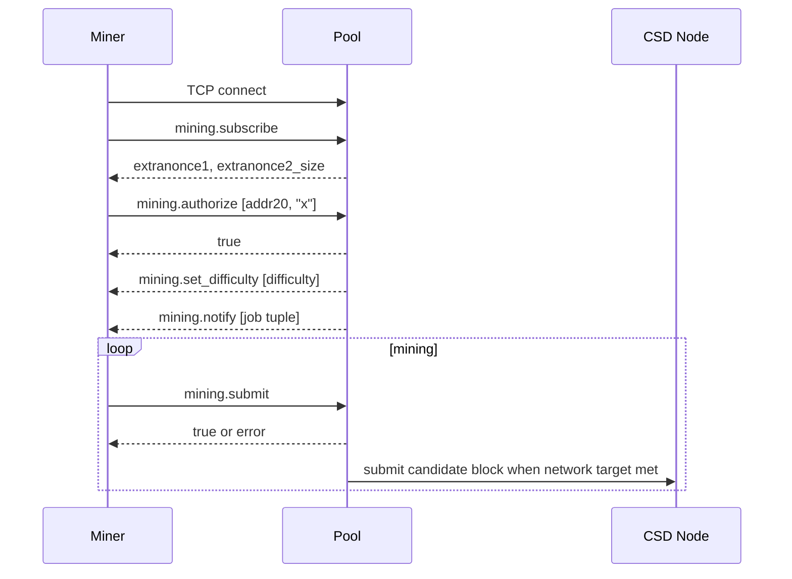

# CSD Pool Protocol Spec

## 1. Compatibility Goal

The first pool server must be compatible with the public CSD miner from
`dangraagu/CSD-Mining-pool-public`.

Protocol:

- TCP
- line-delimited JSON-RPC
- Stratum v1 method names
- one JSON object per line

Default public endpoint:

```text
pool.example.com:3333
```

## 2. Session Lifecycle



## 3. Address And Worker Identity

Initial authorization:

```json
{"id":2,"method":"mining.authorize","params":["<addr20>","x"]}
```

Accepted address forms:

```text
40 lowercase/uppercase hex chars
0x + 40 lowercase/uppercase hex chars
```

Internal normalized form:

```text
40 lowercase hex chars, no 0x
```

Future worker suffix:

```text
addr20.worker
```

Rules:

- reject malformed address
- reject worker names over 64 bytes
- allow worker chars: `a-z A-Z 0-9 _ - .`
- normalize address; preserve worker display name

## 4. JSON-RPC Methods

### 4.1 `mining.subscribe`

Request:

```json
{
  "id": 1,
  "method": "mining.subscribe",
  "params": ["csd-pool-miner/0.1.6"]
}
```

Response:

```json
{
  "id": 1,
  "result": [[], "a1b2c3d4", 4],
  "error": null
}
```

Fields:

- `extranonce1_hex`: exactly 4 bytes hex
- `extranonce2_size`: `4`

### 4.2 `mining.authorize`

Request:

```json
{
  "id": 2,
  "method": "mining.authorize",
  "params": ["<addr20>", "x"]
}
```

Success:

```json
{"id":2,"result":true,"error":null}
```

Failure:

```json
{"id":2,"result":false,"error":[20,"invalid address",null]}
```

### 4.3 `mining.set_difficulty`

Server push:

```json
{
  "id": null,
  "method": "mining.set_difficulty",
  "params": [8.0]
}
```

### 4.4 `mining.notify`

Server push:

```json
{
  "id": null,
  "method": "mining.notify",
  "params": [
    "job_id",
    "prev_hash_be_hex",
    "coinb1_hex",
    "coinb2_hex",
    ["merkle_branch_hex"],
    "version_hex",
    "nbits_hex",
    "ntime_hex",
    true
  ]
}
```

Tuple order must be byte-compatible with the public miner:

```text
[
  job_id,
  prev_hash_be_hex,
  coinb1_hex,
  coinb2_hex,
  merkle_branches_hex[],
  version_hex,
  nbits_hex,
  ntime_hex,
  clean_jobs
]
```

### 4.5 `mining.submit`

Request:

```json
{
  "id": 100,
  "method": "mining.submit",
  "params": [
    "<addr20>",
    "job_id",
    "extranonce2_hex",
    "ntime_hex",
    "nonce_hex"
  ]
}
```

Success:

```json
{"id":100,"result":true,"error":null}
```

Reject:

```json
{"id":100,"result":false,"error":[23,"low difficulty share",null]}
```

Stale:

```json
{"id":100,"result":false,"error":[21,"stale share",null]}
```

## 5. CSD Header Assembly

CSD header is 84 bytes:

```text
version_LE[4]
prev_hash_stored_order[32]
merkle_root[32]
time_u64_LE[8]
bits_LE[4]
nonce_LE[4]
```

Important conversions:

- Stratum `prev_hash_be_hex` is reversed before inserting into the header.
- Stratum `ntime_hex` is 4 bytes and is zero-extended to CSD `u64` time.
- Stratum `nonce_hex` is parsed as `u32`.

## 6. Coinbase Assembly

Coinbase bytes:

```text
coinb1 || extranonce1[4] || extranonce2[4] || coinb2
```

Miner-side equivalent:

```text
extranonce = xn1_low | (xn2 << 32)
coinbase = prefix || extranonce.to_le_bytes() || suffix
```

Pool server must assign unique `extranonce1` per active session and reject
duplicate submit tuples.

## 7. Share Validation

Validation steps:

1. Parse and validate JSON-RPC frame.
2. Check worker is authorized.
3. Look up `job_id`.
4. Confirm job is active or within stale grace window.
5. Decode `extranonce2`, `ntime`, `nonce`.
6. Rebuild coinbase.
7. Compute coinbase txid with `sha256d`.
8. Fold merkle branch.
9. Assemble 84-byte header.
10. Compute `sha256d(header)`.
11. Convert assigned difficulty into `base_share_target / ceil(difficulty)`.
12. Compare hash against the assigned share target.
13. Deduplicate share.
14. Persist accepted share.
15. If hash meets network target, submit block candidate.

## 8. Reject Reasons

Standard reject classes:

```text
invalid-json
unknown-method
unauthorized
invalid-address
malformed-submit
unknown-job
stale-share
duplicate-share
low-difficulty-share
invalid-pow
internal-error
```

Expose aggregate counts publicly. Keep per-IP detail operator-only.

## 9. Vardiff

Default behavior:

- target share interval: 20 seconds
- retarget after accepted share intervals
- min difficulty per port
- max difficulty per port
- difficulty changes apply on next job or immediate `set_difficulty`

Simple adjustment:

```text
if observed_interval < target_interval / 2:
  new_diff = current_diff * 2
if observed_interval > target_interval * 2:
  new_diff = current_diff / 2
new_diff = clamp(new_diff, min_difficulty, max_difficulty)
```

Clamp to port min/max and damp sudden changes.

## 10. Compatibility Tests

Required fixtures:

- known `mining.notify` tuple
- known `extranonce1`
- known `extranonce2`
- known `nonce`
- expected 84-byte header
- expected share hash

Every server implementation must pass:

- notify tuple shape test
- header byte-equivalence test
- submit verify test
- stale share test
- duplicate share test
